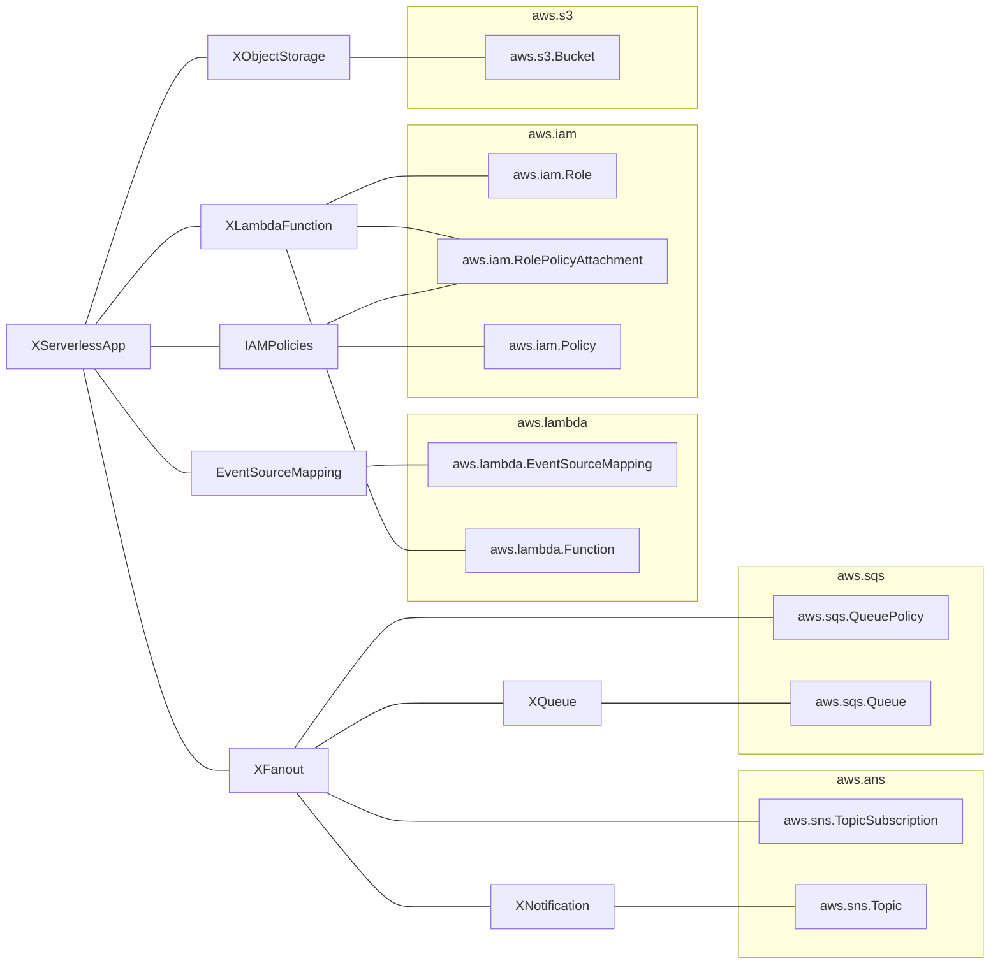

# XServerlessApp
Developer creates claim for XServerlessApp:

* API: [demo-app/manifests/composition/definition.yaml](demo-app/manifests/composition/definition.yaml)
* Composition: [demo-app/manifests/composition/object-processor.yaml](demo-app/manifests/composition/object-processor.yaml)

API for developers:
 - bucketName: crossplane-serverless
 - bucketKey: function.zip
(TODO document other params)

Resources:
  * [XFanout](#xfanout) 
  * [EventSourceMapping](#eventsourcemapping)
  * [XLambdaFunction](#xlambdafunction)
  * [XObjectStorage](#xobjectstorage)
  * [IAMPolicies](#iampolicies)

# XFanout
* API: [demo-infra/compositions/sns-sqs/definition.yaml](demo-infra/compositions/sns-sqs/definition.yaml)
* Composition: [demo-infra/compositions/sns-sqs/sns-sqs.yaml](demo-infra/compositions/sns-sqs/sns-sqs.yaml)

Resources: 
 * [XQueue](#xqueue)
 * [XNotification](#xnotification)
 * aws.sns.TopicSubscription
 * aws.sqs.QueuePolicy

# EventSourceMapping
* API: [demo-infra/compositions/event-source-mapping/definition.yaml](demo-infra/compositions/event-source-mapping/definition.yaml)
* Composition: [demo-infra/compositions/event-source-mapping/sqs.yaml](demo-infra/compositions/event-source-mapping/sqs.yaml)

Resources:
* aws.lambda.EventSourceMapping

# XLambdaFunction
* API: [demo-infra/compositions/lambda/definitions.yaml](demo-infra/compositions/lambda/definitions.yaml)
* Composition: [demo-infra/compositions/lambda/zip.yaml](demo-infra/compositions/lambda/zip.yaml)

Resources:
* aws.iam.Role
* aws.iam.RolePolicyAttachment
* aws.lambda.Function

# XObjectStorage
* API: [demo-infra/compositions/s3/definition.yaml](demo-infra/compositions/s3/definition.yaml)
* Composition: [demo-infra/compositions/s3/general-purpose.yaml](demo-infra/compositions/s3/general-purpose.yaml)

Resources:
* aws.s3.Bucket

# IAMPolicies
* API: [demo-infra/compositions/iam-policy/definition.yaml](demo-infra/compositions/iam-policy/definition.yaml)
* Compositions: [demo-infra/compositions/iam-policy](demo-infra/compositions/iam-policy/)

Resources:
* aws.iam.Policy
* aws.iam.RolePolicyAttachment

# XQueue
* API: [demo-infra/compositions/sqs/definitions.yaml](demo-infra/compositions/sqs/definitions.yaml)
* Composition: [demo-infra/compositions/sqs/sqs.yaml](demo-infra/compositions/sqs/sqs.yaml)

Resources:
* aws.sqs.Queue

# XNotification
* API: [demo-infra/compositions/sns/definition.yaml](demo-infra/compositions/sns/definition.yaml)
* Composition: [demo-infra/compositions/sns/sns.yaml](demo-infra/compositions/sns/sns.yaml)

Resources:
* aws.sns.Topic

# Diagram

